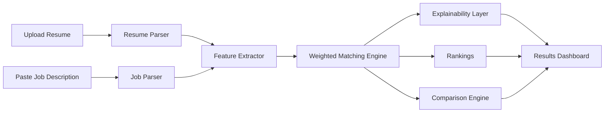

# HireLens AI

<p align="center">
  
</p>

<p align="center">
  <strong>Explainable AI-powered resume screening with a modern recruiter workflow.</strong>
</p>

<p align="center">
  Upload resumes. Parse job descriptions. Rank candidates. Compare profiles. Understand every decision.
</p>

<p align="center">
  
  
  
  
</p>

---

## Overview

HireLens AI is a full-stack recruitment intelligence platform built to make resume screening faster, clearer, and more trustworthy. Instead of acting like a black box, it breaks matching decisions into transparent feature scores across skills, experience, projects, education, and certifications.

The project combines:

- A React + Vite frontend for recruiter workflows
- A FastAPI backend with REST endpoints
- A modular AI pipeline for parsing, scoring, explainability, ranking, and candidate comparison
- A SQLite persistence layer for resumes, jobs, and screening results

## Why It Stands Out

| Feature | What it does |
| --- | --- |
| Multi-format resume parsing | Supports `PDF`, `DOCX`, and `TXT` uploads |
| Structured job analysis | Extracts required skills, preferred skills, experience, and education |
| Explainable matching | Shows why a candidate is selected or rejected |
| Candidate rankings | Orders applicants by computed fit score |
| Side-by-side comparison | Compares two resumes against the same role |
| Persistent workflow | Stores resumes, jobs, and results in SQLite |

## Product Flow



## Screens

<p align="center">
  
  
</p>

<p align="center">
  
  
</p>

## Tech Stack

### Frontend

- React 19
- Vite 8
- Tailwind CSS 4
- React Router DOM 7
- Axios
- Chart.js + `react-chartjs-2`
- `react-dropzone`

### Backend

- FastAPI
- Uvicorn
- SQLAlchemy
- `python-multipart`
- SQLite

### AI / NLP

- `pdfplumber`
- `python-docx`
- `spacy`
- `sentence-transformers`
- `scikit-learn`
- `shap`
- `lime`
- `keybert`
- `numpy`

## Project Structure

```text
HireLens AI/
├── ai/                 # Parsing, feature extraction, explainability, comparison, matching
├── backend/            # FastAPI app, routes, config, database, schemas, models
├── data/resumes/       # Uploaded resume files
├── database/           # SQLite database
├── docs/               # Report, SRS, diagrams, screenshots
├── frontend/           # React + Vite client
└── tests/              # Test area
```

## Core Modules

| Module | Responsibility |
| --- | --- |
| `ai/resume_parser` | Extracts structured candidate data from uploaded files |
| `ai/job_parser` | Parses job descriptions into machine-readable criteria |
| `ai/feature_extractor` | Computes skill, experience, education, and project signals |
| `ai/matching_engine` | Produces weighted scores and final predictions |
| `ai/explainability` | Generates summaries, strengths, weaknesses, and feature explanations |
| `ai/comparison` | Compares two candidates for the same role |
| `backend/api/routes.py` | Exposes the full screening API |
| `frontend/src/pages` | Recruiter-facing pages for upload, results, compare, and rankings |

## Quick Start

### 1. Backend

```bash
cd backend
python -m venv .venv
.venv\Scripts\activate
pip install -r requirements.txt
cd ..
python -m uvicorn backend.main:app --reload
```

Backend runs on `http://localhost:8000`

### 2. Frontend

```bash
cd frontend
npm install
npm run dev
```

Frontend runs on `http://localhost:5173`

The Vite dev server already proxies `/api` requests to `http://localhost:8000`.

## API Snapshot

### Resume management

- `POST /api/upload_resume`
- `GET /api/resumes`
- `DELETE /api/resumes/{resume_id}`

### Job descriptions

- `POST /api/upload_job`
- `GET /api/jobs`
- `DELETE /api/jobs/{job_id}`

### Matching and results

- `POST /api/match_resume`
- `POST /api/match_batch`
- `GET /api/results/{job_id}`
- `GET /api/results/{job_id}/detail/{resume_id}`
- `POST /api/compare_resumes`
- `GET /api/health`

## Matching Logic

The current scoring model uses weighted feature aggregation:

- Skills: `40%`
- Experience: `25%`
- Projects: `20%`
- Education: `15%`
- Certifications: up to `5%` bonus

The default selection threshold is `60%`.

## Supported Inputs

### Resume upload

- `.pdf`
- `.docx`
- `.txt`
- Max size: `10 MB`

### Stored entities

- Resumes
- Job descriptions
- Screening results
- Uploaded resume files

## Local Data

By default, the app uses:

- Database: `database/hirelens.db`
- Upload directory: `data/resumes/`

No extra database setup is required for local development.

## Docs

Additional project documentation is available here:

- [Project Report](./docs/HireLens_AI_Project_Report.md)
- [Software Requirements Specification](./docs/HireLens_AI_SRS.md)

## Roadmap Ideas

- Semantic similarity scoring using sentence embeddings
- Richer XAI with SHAP and LIME integration
- Recruiter authentication and multi-user workspaces
- Async background processing for larger resume batches
- PostgreSQL deployment path for production scale
- Candidate feedback and CV improvement suggestions

## License

This repository currently does not define a license. Add one before public distribution if needed.
